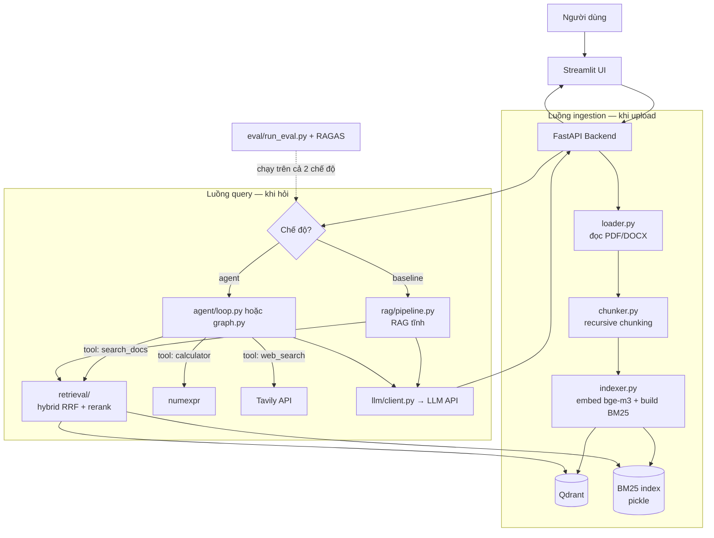

# Architecture — Agentic RAG Assistant

## 1. Tổng quan hệ thống

Hệ thống gồm 2 luồng chính dùng chung tầng retrieval: **luồng ingestion** (khi upload tài liệu) và **luồng query** (khi hỏi). Luồng query có 2 chế độ chạy song song: RAG tĩnh (baseline) và Agent.

Luồng một câu hỏi qua chế độ agent: câu hỏi → agent phân tích, chọn tool → `search_docs` chạy hybrid search (vector + BM25, gộp RRF) → rerank cross-encoder lấy top-5 → agent grading "đủ chưa?" → thiếu thì rewrite truy vấn quay lại (≤2 lần) → sinh câu trả lời kèm trích dẫn [nguồn, trang] → stream về UI kèm trace từng bước.

## 2. Tech stack đã chốt

| Thành phần | Lựa chọn | Lý do |
|---|---|---|
| Backend framework | FastAPI + Uvicorn | Async phù hợp I/O-bound (chờ LLM API), tự sinh OpenAPI docs, chuẩn ngành cho AI service |
| Database | Qdrant (vector) + BM25 index (rank_bm25, pickle) | Xem ADR-002; không cần RDBMS ở phạm vi này — metadata nằm trong payload của Qdrant |
| Embedding / Rerank | BAAI/bge-m3 + BAAI/bge-reranker-v2-m3, chạy GPU (CUDA) khi dev, fallback CPU qua config `DEVICE` | Đa ngôn ngữ tốt cho tiếng Việt, miễn phí; ~3–4GB VRAM cho cả hai, rerank nhanh gấp nhiều lần CPU (xem ADR-006) |
| LLM | API bên ngoài qua wrapper `llm/client.py`; dev mặc định Ollama + Qwen 7B quantized (Q4) chạy GPU | Xem ADR-001 và ADR-006 |
| Agent | Vòng lặp tự viết (`loop.py`) + bản LangGraph (`graph.py`) | Xem ADR-004 |
| Message/streaming | SSE (Server-Sent Events) từ FastAPI về UI | Một chiều server→client là đủ cho chat; đơn giản hơn WebSocket, không cần queue ở quy mô 1 user |
| UI | Streamlit | Tốc độ phát triển cho 1 người; xem ADR-005 |
| Web search tool | Tavily API (free tier) | Thiết kế cho LLM, kết quả sạch, khỏi tự parse HTML |
| Evaluation | RAGAS + dataset tự xây (≥50 câu, gắn nhãn loại câu hỏi) | Chuẩn ngành; nhãn loại câu hỏi cho phép so sánh agent vs baseline theo nhóm |
| Deploy/infra | Docker Compose (api + qdrant + ui); GitHub Actions (ruff + pytest); deploy HF Spaces/Railway | Một lệnh chạy toàn hệ thống; CI tối thiểu của repo nghiêm túc |

## 3. Architecture Decision Records (ADR)

> Mỗi quyết định kiến trúc lớn = 1 ADR. Không sửa ADR cũ — nếu quyết định thay đổi, thêm ADR mới ghi "supersedes ADR-00X".

### ADR-001: Truy cập LLM qua một wrapper duy nhất, không gọi SDK rải rác
- **Ngày:** 2026-07-10
- **Bối cảnh:** Cần dùng model rẻ/local khi dev (ngân sách ~20 USD) nhưng model tốt khi eval/demo; SDK các hãng khác nhau; code gọi LLM xuất hiện ở nhiều nơi (RAG, agent, grading, rewrite).
- **Các lựa chọn đã cân nhắc:** (A) Gọi thẳng SDK từng nơi — nhanh lúc đầu, đổi model phải sửa khắp repo. (B) Wrapper tự viết `llm/client.py` thống nhất interface, cấu hình model qua `.env`. (C) Dùng LiteLLM — mạnh nhưng thêm dependency lớn cho nhu cầu nhỏ.
- **Quyết định:** B — wrapper tự viết, có retry, timeout, đếm token và log chi phí.
- **Lý do:** Đổi model = sửa 1 biến môi trường; đây cũng là điểm kiến trúc thể hiện tư duy tách phụ thuộc khi phỏng vấn. Chấp nhận tự bảo trì ~100 dòng code.
- **Hệ quả:** Mọi module cấm import SDK LLM trực tiếp; chỉ import từ `app/llm/client.py`. Nếu sau này cần nhiều provider phức tạp, viết ADR mới chuyển sang LiteLLM.

### ADR-002: Qdrant làm vector DB (thay vì FAISS/Chroma/Pinecone)
- **Ngày:** 2026-07-10
- **Bối cảnh:** Cần vector DB có filter metadata (nguồn, trang, collection), chạy local miễn phí, và "giống production" để có chuyện nói khi phỏng vấn.
- **Các lựa chọn đã cân nhắc:** (A) FAISS — in-memory, nhanh, nhưng không có server/filter/persistence tử tế. (B) Chroma — dễ nhất nhưng ít tính năng production. (C) Qdrant — server riêng qua Docker, filter payload mạnh, API tốt. (D) Pinecone — cloud trả phí, dữ liệu rời máy.
- **Quyết định:** C — Qdrant chạy bằng Docker; FAISS chỉ dùng trong notebook thử nghiệm tuần 2.
- **Lý do:** Cân bằng giữa dễ dùng và production-ready; miễn phí; volume Docker giải quyết persistence.
- **Hệ quả:** Thêm 1 service trong docker-compose; mọi truy cập Qdrant đi qua `retrieval/vector_store.py` để sau này thay được bằng DB khác.

### ADR-003: Hybrid search (BM25 + vector, gộp RRF) thay vì vector search thuần
- **Ngày:** 2026-07-10
- **Bối cảnh:** Tài liệu pháp luật tiếng Việt đầy mã định danh ("Nghị định 13/2023", "Điều 139") và tên riêng — vector search hay trượt các truy vấn dạng này.
- **Các lựa chọn đã cân nhắc:** (A) Vector thuần — đơn giản, trượt keyword. (B) BM25 thuần — bắt keyword, mù ngữ nghĩa. (C) Hybrid gộp bằng RRF rồi rerank cross-encoder. (D) Dùng sparse vector có sẵn của bge-m3 trong Qdrant — gọn nhưng khó giải thích "bên trong" khi phỏng vấn.
- **Quyết định:** C, với pipeline 2 tầng: hybrid lấy top-20 → rerank còn top-5.
- **Lý do:** RRF không cần chuẩn hóa điểm giữa 2 hệ, dễ hiểu, tự viết được ~10 dòng; cải thiện phải được chứng minh bằng eval (mục tiêu: context precision tăng so với baseline).
- **Hệ quả:** Phải bảo trì BM25 index song song với Qdrant (rebuild khi upload tài liệu mới); chấp nhận thêm ~1–2s latency do rerank trên CPU.

### ADR-004: Agent viết tay vòng lặp trước, LangGraph sau — giữ cả hai
- **Ngày:** 2026-07-10
- **Bối cảnh:** Người làm là fresher cần hiểu bản chất agent để phỏng vấn; đồng thời LangGraph là chuẩn công nghiệp đáng có trong CV. Luồng cần grading + rewrite (quay lui có điều kiện).
- **Các lựa chọn đã cân nhắc:** (A) Chỉ tự viết loop — hiểu sâu, nhưng luồng quay lui phức tạp dần sẽ rối. (B) Chỉ LangGraph — nhanh, nhưng rủi ro "dùng mà không hiểu". (C) Làm A ở tuần 6 rồi B ở tuần 7, giữ cả hai sau một interface chung.
- **Quyết định:** C. `agent/loop.py` (LLM tự do chọn tool) và `agent/graph.py` (luồng tường minh có grading/rewrite) cùng expose hàm `run(question) -> {answer, trace, steps}`.
- **Lý do:** Vừa học được bản chất vừa có framework trong CV; so sánh 2 cách là tư liệu phỏng vấn tốt.
- **Hệ quả:** Chi phí bảo trì 2 bản; API nhận tham số `mode` (baseline / agent-loop / agent-graph); eval chạy được cả ba.

### ADR-005: Streamlit cho UI, chấp nhận không "production"
- **Ngày:** 2026-07-10
- **Bối cảnh:** 1 người làm trong 10 tuần, trọng tâm là AI pipeline chứ không phải frontend; nhưng demo phỏng vấn cần nhìn ổn và hiện được trace agent thời gian thực.
- **Các lựa chọn đã cân nhắc:** (A) React — đẹp, chuẩn, tốn 2–3 tuần không phục vụ mục tiêu chính. (B) Streamlit — vài giờ có chat UI, hỗ trợ streaming đủ dùng. (C) Gradio — tương tự B, nhưng Streamlit quen thuộc hơn với HR/JD Việt Nam.
- **Quyết định:** B.
- **Lý do:** Tối đa thời gian cho retrieval/agent/eval — nơi tạo khác biệt thật.
- **Hệ quả:** UI giao tiếp với backend qua REST/SSE (không import trực tiếp code pipeline) để sau này thay React không đụng backend. Ghi rõ trong README: "UI là demo; production sẽ dùng React".

### ADR-006: Phân bổ 8GB VRAM — GPU khi dev, CPU khi deploy
- **Ngày:** 2026-07-10
- **Bối cảnh:** Máy dev có RTX 5060 8GB VRAM; bản deploy demo (HF Spaces free / VPS rẻ) không có GPU. 8GB không đủ để chạy đồng thời cả ba: LLM 7B quantized (~5–6GB gồm KV cache) + bge-m3 (~1.5–2GB) + reranker (~1.5GB).
- **Các lựa chọn đã cân nhắc:** (A) Dồn tất cả lên GPU — tràn VRAM (OOM) hoặc Ollama bị đẩy bớt layer xuống CPU, chậm bất thường khó debug. (B) LLM local chiếm GPU, embedding/rerank chạy CPU — phí GPU cho phần nhạy latency nhất (rerank chạy mỗi query). (C) Embedding + reranker thường trú trên GPU (~3–4GB); LLM dev dùng Gemini free/API, hoặc khi muốn chạy offline hoàn toàn thì dùng Ollama với model nhỏ hơn (Qwen 3B–4B) hoặc chấp nhận Qwen 7B chia sẻ VRAM với tốc độ giảm.
- **Quyết định:** C, kèm hai quy tắc: (1) thiết bị của mọi model đọc từ config `DEVICE=cuda|cpu`, cấm hardcode; (2) chế độ CPU thuần là đường chạy bắt buộc phải hoạt động (CI test và bản deploy đều chạy CPU).
- **Lý do:** Rerank là thành phần hưởng lợi GPU rõ nhất trên mỗi request; LLM đã có nguồn free bên ngoài (Gemini) nên không cần tranh VRAM. Giữ được cam kết "docker compose up chạy ở mọi máy".
- **Hệ quả:** `config.py` thêm `DEVICE`, `OLLAMA_MODEL`; docker-compose mặc định chạy CPU, thêm profile `gpu` dùng nvidia-container-toolkit cho ai có GPU; README ghi rõ benchmark latency đo trên GPU khác bản deploy CPU; requirements ghim PyTorch bản CUDA 12.8+ (RTX 5060 là kiến trúc Blackwell, bản torch cũ không nhận GPU).

## 4. Ranh giới module / trách nhiệm

| Module | Trách nhiệm | Giao tiếp |
|---|---|---|
| `app/api/` | Nhận request, validate (Pydantic), điều phối, SSE streaming | REST + SSE với UI; gọi hàm nội bộ các tầng dưới |
| `app/ingestion/` | PDF/DOCX → chunks → embed → ghi Qdrant + BM25 | Được API gọi khi upload; ghi vào 2 store |
| `app/retrieval/` | Hybrid search + RRF + rerank. **Không biết gì về LLM/agent** | Hàm thuần: nhận query string, trả list chunk có điểm |
| `app/rag/pipeline.py` | RAG tĩnh baseline: retrieve → prompt → generate | Gọi `retrieval/` và `llm/client.py` |
| `app/agent/` | Ra quyết định: chọn tool, grading, rewrite, tổng hợp. **Không chứa logic tìm kiếm** — chỉ gọi tool | Tool `search_docs` gọi sang `retrieval/`; expose `run()` thống nhất |
| `app/llm/` | Điểm duy nhất gọi LLM API: retry, timeout, đếm token, log chi phí; chứa toàn bộ prompt | Được `rag/` và `agent/` gọi; cấm nơi khác import SDK LLM |
| `eval/` | Dataset + script đo RAGAS trên mọi chế độ, xuất report | Gọi qua cùng interface `run()` / pipeline như API dùng |
| `ui/` | Hiển thị chat, upload, trace agent | Chỉ nói chuyện với backend qua HTTP/SSE |

Quy tắc phụ thuộc một chiều: `ui → api → (rag | agent) → retrieval → stores`, và mọi nhánh gọi LLM đều qua `llm/`. Cấm import ngược chiều.

## 5. Rủi ro kỹ thuật đã biết

1. **BM25 index dạng pickle, rebuild toàn bộ mỗi lần upload** — chấp nhận vì kho tài liệu nhỏ; nợ kỹ thuật: chuyển Elasticsearch/Qdrant sparse nếu scale (ghi ở Future work).
2. **Rerank chậm ở bản deploy** — trên GPU dev chỉ vài trăm ms, nhưng bản demo public chạy CPU tốn ~1–2s cho 20 ứng viên; chấp nhận, giảm nhẹ bằng giới hạn 20 ứng viên và ghi rõ trong README rằng benchmark latency đo trên máy nào.
3. **Grading bằng LLM có thể chấm sai** (nói "đủ" khi thiếu) — giảm nhẹ bằng prompt ràng buộc output + đo faithfulness trong eval; không có cách triệt để ở quy mô này.
4. **Chi phí/latency agent không dự đoán trước được** với câu hỏi lạ — chặn bằng MAX_STEPS=6, retries≤2, log token mọi request.
5. **PDF tiếng Việt chất lượng kém** (font lỗi, không dấu) — ngoài phạm vi OCR; ingestion phải log cảnh báo khi tỷ lệ ký tự bất thường cao thay vì im lặng index rác.
6. **Streamlit giới hạn khả năng streaming/trace phức tạp** — chấp nhận theo ADR-005; ranh giới REST/SSE giữ đường lùi sang React.
7. **Tràn 8GB VRAM (OOM) khi vô tình load đồng thời LLM local + embedding + reranker** — chặn theo ADR-006; theo dõi bằng `nvidia-smi`; nếu dùng Ollama song song, đặt `OLLAMA_KEEP_ALIVE` ngắn để model tự giải phóng VRAM khi rảnh.
8. **Tương thích RTX 5060 (Blackwell, sm_120)** — cần driver NVIDIA mới + PyTorch build CUDA 12.8+; nếu cài torch mặc định phiên bản cũ sẽ gặp lỗi "no kernel image available". Giảm nhẹ: ghim phiên bản trong requirements, ghi bước cài đặt GPU riêng trong README, và mọi code đều chạy được `DEVICE=cpu` làm đường lùi.
